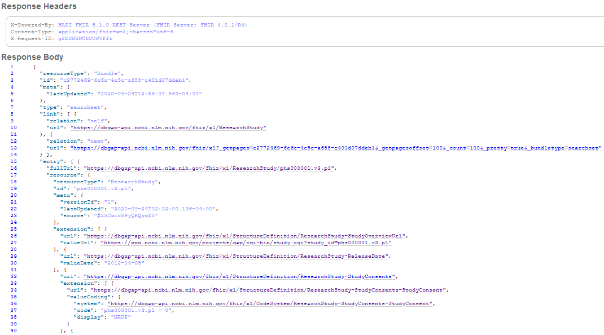
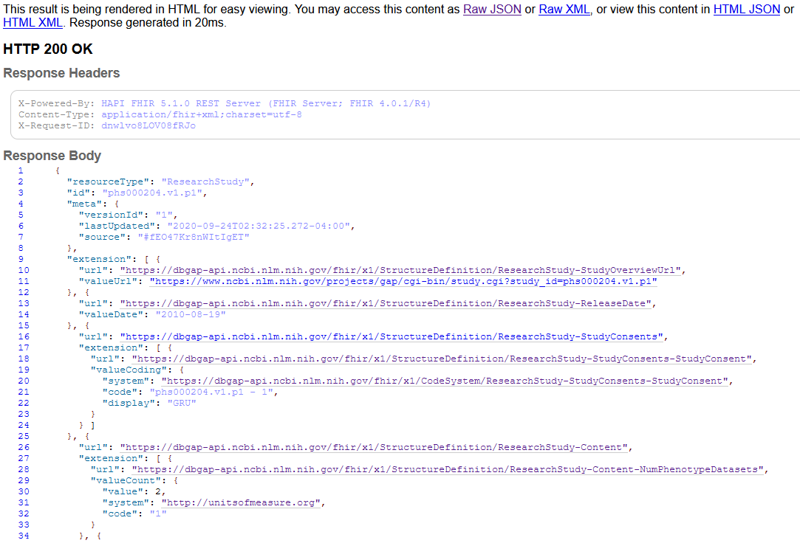

# Location

The dbGaP FHIR API is available at [http://dbgap-api.ncbi.nlm.nih.gov/fhir/x1](http://dbgap-api.ncbi.nlm.nih.gov/fhir/x1). It is a standard FHIR API. The documentation for FHIR is at <https://www.hl7.org/fhir/>. This guide is just a quick-start. We have documented how dbGaP concepts map to FHIR resources at [https://dbgap-api.ncbi.nlm.nih.gov/fhir-mapping/interactive](https://dbgap-api.ncbi.nlm.nih.gov/fhir-mapping/interactive).

# Retrieving all studies

We model study metadata using FHIR ResearchStudy objects. The full specification is at <https://www.hl7.org/fhir/researchstudy.html>

To retrieve all the studies we have stored, you would start with the URL:

<http://dbgap-api.ncbi.nlm.nih.gov/fhir/x1/ResearchStudy>

This will return a Bundle resource (you can see which type of resource it is by looking at the "resourceType" field) 
which contains an array of [FHIR ResearchStudy objects](https://www.hl7.org/fhir/researchstudy.html).
You can change the number of studies returned for each request by appending the parameter "_count=" followed by an integer.
For example, <http://dbgap-api.ncbi.nlm.nih.gov/fhir/x1/ResearchStudy?_count=2> will only return the first two studies on the first page.
In the following, we will assume you've left the count at the default value of 100.

## First 100 studies



## Next and previous

You can get the next 100 studies by accessing the URL (line 13) in the object under the link field (line 8) which is labeled with the relation "next" (line 12).
This "next" link will only be present if there were more than 100 studies in the result.
If this is not the first page of studies in a result, there will be a link with the relation "previous" that goes to the previous 100 studies.

## Entries

All 100 studies can be found under the `entry` field. 
Each entry will have 3 fields:  
1. `fullURL` - a link directly to that study object.
2. `resource` - the object you'd find at that `fullURL` link.
3. `search` - parameters about the search that produced this entry.

# Retrieving studies matching a criterion (searching)

Rather than retrieving all studies, you can get a subset by including search parameters.
The list of available search parameters is available at <http://dbgap-api.ncbi.nlm.nih.gov/fhir/x1/metadata>. 
  
You can find ResearchStudy search parameters at the [JSONPath](https://goessner.net/articles/JsonPath/)  
```jsonpath
$.rest[?(@.mode=='server')].resource[?(@.type=='ResearchStudy')].searchParam
``` 

A more human-readable version is in the official documents <https://www.hl7.org/fhir/researchstudy.html#search>.
This has only the search parameters defined by the standard and omits 
parameters unique to the dbGaP API.

### Prefix

Searches work by adding search parameters after a "?" as query parameters.
For example, we can search for studies whose title starts with "ADGC" using <http://dbgap-api.ncbi.nlm.nih.gov/fhir/x1/ResearchStudy?title=ADGC>.
This will return a single study, the "ADGC Genome Wide Association Study."
Note that if you want to include characters besides letters and numbers (like spaces), you will need to "[url-encode](https://en.wikipedia.org/wiki/Percent-encoding)" them.
The encoding for the space character is %20. So, to search for a study starting with "ADGC Genome", we use <http://dbgap-api.ncbi.nlm.nih.gov/fhir/x1/ResearchStudy?title=ADGC%20Genome>.

### Substring

We can also search for part of a text field that is not at the beginning.
For example, <http://dbgap-api.ncbi.nlm.nih.gov/fhir/x1/ResearchStudy?title:contains=Wide> will return all the studies whose title includes the word "Wide".
The `title` search parameter is of type `string` which allows the `contains` operator.
You can get the full list of what you can do with string parameters at <http://hl7.org/fhir/search.html#string>.

### Tokens

The `keyword` search parameter is of type `token`. Unlike `string`, `token` does **not** allow the `contains` operator.
You can search for text that begins a string <http://dbgap-api.ncbi.nlm.nih.gov/fhir/x1/ResearchStudy?keyword:text=Dementia>, but this will miss records that do not have "dementia" as the first word in one of their `keyword` entries.

### Ids

You can also search for objects by one or more ids separated by a comma.
This is most useful when you want to retrieve multiple objects in a single
request, and you already know their ids.
For example, <https://dbgap-api.ncbi.nlm.nih.gov/fhir/x1/ResearchStudy?_id=phs000005,phs000001> will retrieve two studies.

# Retrieving metadata for one study

You can access the metadata for a single study with a URL formed by adding the study's id after <http://dbgap-api.ncbi.nlm.nih.gov/fhir/x1/ResearchStudy/>.

For example:  
<https://dbgap-api.ncbi.nlm.nih.gov/fhir/x1/ResearchStudy/phs000204>  
**Note that this specific study id may not be accessible and is used only as an example.*

Here the study's id is `phs000204`.
This will return a JSON object representing the study.
If you access this URL using a web browser, the server will detect that and give you a nicely formatted HTML page with the JSON on it.
Using a GET request from a program will still return the JSON.

## Result of retrieving one study in a web browser



## The `extension` fields

We make heavy use of the `extension` field to model things not available in the standard FHIR specification.
Line 10 <!-- TODO: FHIR-1300 Fix the line references when you update the image 
--> holds the 
first occurrence of an extension in the example.
Each extension has a URL that links to a machine-readable description of that field called a StructureDefinition.
The URLs are named to allow a human to guess their semantics.
The names are separated by the hyphen character (-) into fields and subfields.
So <https://dbgap-api.ncbi.nlm.nih.gov/fhir/x1/StructureDefinition/ResearchStudy-Content-NumPhenotypeDatasets> is the `NumPhenotypeDatasets` field in the `Content` field in the `ResearchStudy` resource.

For example, line 13 has a URL that shows it is the ReleaseDate field and its value (on line 14) is "2010-08-19", meaning August 19, 2010, in ISO date format.

## Codeable Concepts

Many values are codes within a system. For example, line 19 says 
"`valueCoding`" indicating that its value comes from a code system. These have 
several fields (FHIR has [more documentation on Coding](https://www.hl7.org/fhir/datatypes.html#Coding)). "`system`" is a URL that identifies which coding system is being used. "`code`" is a code within that system. In this example, the system is <https://dbgap-api.ncbi.nlm.nih.gov/fhir/x1/CodeSystem/ResearchStudy-StudyConsents-StudyConsent> and the code with the system is "phs000204.v1.p1 - 1". There is also a display value ("GRU") for quick-reference or to use in displaying this code to a human user. If you look at the [CodeSystem object](https://dbgap-api.ncbi.nlm.nih.gov/fhir/x1/CodeSystem/ResearchStudy-StudyConsents-StudyConsent), and find the code "phs000204.v1.p1 - 1", you can see a slightly expanded definition for this field, "General Research Use (GRU)".

* * * * *

# Other objects

Besides ResearchStudy, the server also contains Patient and Observation data. This is individual-level data simulated to resemble TOPMed's new, harmonized data. In the future, it will require authentication, but is currently available for demonstration purposes. Observations describe individual measurements like blood pressure or survey answers. Patients are the research subjects from which the measurements were taken. We intend to eventually use the ResearchSubject resource to connect Patients with ResearchStudy resources.

For more information about Patient and Observation resources, please visit the FHIR website:

-   [Patient](https://www.hl7.org/fhir/Patient.html)
-   [Observation](https://www.hl7.org/fhir/observation.html)
